```mermaid
graph TB
  %% GitHub compatible simplified version (using only basic syntax)

  subgraph ext_layer[External Systems and Data Sources Layer]
    ext_contrib[Community Contributors]
    ext_sheet[Google Sheets / External Tables]
    ext_md[External Markdown Prompts]
    ext_api[Reserved: Other Data Sources / APIs]
    ext_contrib --> ext_sheet
    ext_contrib --> ext_md
    ext_api --> ext_sheet
  end

  subgraph ingest_layer[Data Ingestion and Collection Layer]
    excel_raw[prompt_excel/*.xlsx]
    md_raw[prompt_docs/External MD Input]
    excel_to_docs[prompts-library/scripts/excel_to_docs.py]
    docs_to_excel[prompts-library/scripts/docs_to_excel.py]
    ingest_bus[Standardized Data Frame]
    ext_sheet --> excel_raw
    ext_md --> md_raw
    excel_raw --> excel_to_docs
    md_raw --> docs_to_excel
    excel_to_docs --> ingest_bus
    docs_to_excel --> ingest_bus
  end

  subgraph core_layer[Data Processing and Intelligent Decision Layer / Core]
    ingest_bus --> validate[Field Validation and Normalization]
    validate --> transform[Format Mapping Transformation]
    transform --> artifacts_md[prompt_docs/Standardized MD]
    transform --> artifacts_xlsx[prompt_excel/Export XLSX]
    orchestrator[main.py · scripts/start_convert.py] --> validate
    orchestrator --> transform
  end

  subgraph consume_layer[Execution and Consumption Layer]
    artifacts_md --> catalog_coding[i18n/zh/prompts/02-编程提示词]
    artifacts_md --> catalog_system[i18n/zh/prompts/01-系统提示词]
    artifacts_md --> catalog_meta[i18n/zh/prompts/00-元提示词]
    artifacts_md --> catalog_user[i18n/zh/prompts/03-用户提示词]
    artifacts_md --> docs_repo[i18n/zh/documents/*]
    artifacts_md --> new_consumer[Reserved: Other Downstream Channels]
    catalog_coding --> ai_flow[AI Pair Programming Workflow]
    ai_flow --> deliverables[Project Context / Plan / Code Output]
  end

  subgraph ux_layer[User Interaction and Interface Layer]
    cli[CLI: python main.py] --> orchestrator
    makefile[Makefile Task Encapsulation] --> cli
    readme[README.md Usage Guide] --> cli
  end

  subgraph infra_layer[Infrastructure and Cross-cutting Capabilities Layer]
    git[Git Version Control] --> orchestrator
    backups[backups/一键备份.sh · backups/快速备份.py] --> artifacts_md
    deps[requirements.txt · scripts/requirements.txt] --> orchestrator
    config[prompts-library/scripts/config.yaml] --> orchestrator
    monitor[Reserved: Logging and Monitoring] --> orchestrator
  end
```

<!--
-------------------------------------------------------------------------------
  Project Header Area (HEADER)
-------------------------------------------------------------------------------
-->
<p align="center">
  <!-- Recommended size: 1280x640px. Can be created using tools like Canva, Figma or https://banners.beyondco.de/ -->
  
</p>

<div align="center">

[中文](../../README.md) | [English](./README.md)

# Vibe Coding Guide

**The ultimate workstation for bringing ideas to life through AI pair programming**

---

<!--
  Badges Area (BADGES)
-->
<!-- Project Status Badges -->
<p>
  <a href="LICENSE"></a>
  <a href="https://github.com/tukuaiai/vibe-coding-cn"></a>
  <a href="https://github.com/tukuaiai/vibe-coding-cn"></a>
  <a href="https://x.com/123olp"></a>
  <a href="https://t.me/glue_coding"></a>
</p>

<!-- Resource Quick Links - Grouped by Importance -->
<!-- 🔴 Core Concepts (Red) -->
<p>
  <a href="../zh/documents/-01-哲学与方法论/README.md"></a>
  <a href="../zh/documents/01-入门指南/00-Vibe%20Coding%20哲学原理.md"></a>
  <a href="../zh/documents/00-基础指南/胶水编程.md"></a>
  <a href="../zh/documents/02-方法论/图形化AI协作-Canvas白板驱动开发.md"></a>
  <a href="../zh/documents/01-入门指南/README.md"></a>
  <a href="../zh/documents/00-基础指南/血的教训.md"></a>
  <a href="../zh/documents/00-基础指南/语言层要素.md"></a>
  <a href="../zh/documents/00-基础指南/常见坑汇总.md"></a>
  <a href="../zh/documents/00-基础指南/强前置条件约束.md"></a>
  <a href="../zh/documents/04-资源/外部资源聚合.md"></a>
  <a href="../zh/documents/00-基础指南/A%20Formalization%20of%20Recursive%20Self-Optimizing%20Generative%20Systems.md"></a>
  <a href="../zh/documents/00-基础指南/编程之道.md"></a>
  <a href="../zh/documents/03-实战/README.md"></a>
  <a href="../zh/documents/04-资源/工具集.md"></a>
  <a href="../zh/prompts/"></a>
  <a href="../zh/skills/"></a>
  <a href="https://docs.google.com/spreadsheets/d/1Ifk_dLF25ULSxcfGem1hXzJsi7_RBUNAki8SBCuvkJA/edit?gid=1254297203#gid=1254297203"></a>
  <a href="https://github.com/x1xhlol/system-prompts-and-models-of-ai-tools"></a>
  <a href="../../libs/external/chat-vault/README_CN.md"></a>
</p>

[📋 Tools & Resources](#-the-tools-qi)
[🚀 Getting Started](#-getting-started)
[🎯 Original Repository Translation](#-original-repository-translation)
[⚙️ Full Setup Process](#️-full-setup-process)
[📞 Contact](#-contact)
[✨ Support Project](#-support-project)
[🤝 Contributing](#-contributing)

AI interpretation link for this repository: [zread.ai/tukuaiai/vibe-coding-cn](https://zread.ai/tukuaiai/vibe-coding-cn/1-overview)

</div>

## 🎲 Preface

**This is a constantly growing and self-negating project. All current experience and capabilities may become meaningless as AI evolves. So always maintain an AI-first mindset, don't be complacent, all experience may become obsolete - view it dialectically 🙏🙏🙏**

---

<details>
<summary><strong>⚡ 5-Minute Quick Start</strong></summary>

## ⚡ 5-Minute Quick Start

> Already have network and development environment? Start Vibe Coding directly!

**Step 1**: Copy the prompt below and paste it into [Claude](https://claude.ai/) or [ChatGPT](https://chatgpt.com/)

```
You are a professional AI programming assistant. I want to develop a project using the Vibe Coding approach.

Please ask me first:
1. What project do you want to build? (one sentence description)
2. What programming languages are you familiar with? (it's okay if you're not familiar with any)
3. What is your operating system?

Then help me:
1. Recommend the simplest tech stack
2. Generate project structure
3. Guide me step by step to complete development

Requirement: After completing each step, ask me if it was successful before continuing to the next step.
```

**Step 2**: Follow AI's guidance to turn your ideas into reality 🚀

**That's it!** Read on for more advanced content 👇

</details>

---

## 🚀 Getting Started

Complete beginner? Follow these steps in order:

0. [00-Vibe Coding Philosophy](../zh/documents/01-入门指南/00-Vibe%20Coding%20哲学原理.md) - Understand core concepts
1. [01-Network Environment Configuration](../zh/documents/01-入门指南/01-网络环境配置.md) - Configure network access
2. [02-Development Environment Setup](../zh/documents/01-入门指南/02-开发环境搭建.md) - Copy prompts to AI, let AI guide you through environment setup
3. [03-IDE Configuration](../zh/documents/01-入门指南/03-IDE配置.md) - Configure VS Code editor
4. [04-OpenCode-CLI Configuration](../zh/documents/01-入门指南/04-OpenCode-CLI配置.md) - Free AI CLI tool, supports GLM-4.7/MiniMax M2.1 and other models

---

<details open>
<summary><strong>🧬 Glue Coding</strong></summary>

> **The Holy Grail and Silver Bullet of Software Engineering**

Glue Coding is the ultimate evolution of Vibe Coding, potentially solving three fatal flaws:

| Problem | Solution |
|:---|:---|
| 🎭 AI Hallucination | ✅ Only use verified mature code, zero hallucination |
| 🧩 Complexity Explosion | ✅ Every module is a battle-tested wheel |
| 🎓 High Barrier | ✅ You only need to describe "how to connect" |

**Core Philosophy**: Copy instead of write, connect instead of create, reuse instead of reinvent.

👉 [Learn more about Glue Coding](../zh/documents/00-基础指南/胶水编程.md)

</details>

<details open>
<summary><strong>🎨 Canvas Whiteboard-Driven Development</strong></summary>

> **A New Paradigm for Visual AI Collaboration**

Traditional development: Code → Verbal communication → Mental architecture → Code out of control

Canvas approach: **Code ⇄ Whiteboard ⇄ AI ⇄ Human**, whiteboard becomes the single source of truth

| Pain Point | Solution |
|:---|:---|
| 🤖 AI can't understand project structure | ✅ AI directly reads whiteboard JSON, instantly understands architecture |
| 🧠 Humans can't remember complex dependencies | ✅ Clear connections, one glance shows all impacts |
| 💬 Team collaboration relies on verbal communication | ✅ Point at the whiteboard to explain, newcomers understand in 5 minutes |

**Core Philosophy**: Graphics are first-class citizens, code is the serialized form of the whiteboard.

👉 [Learn more about Canvas Whiteboard-Driven Development](../zh/documents/02-方法论/图形化AI协作-Canvas白板驱动开发.md)

</details>

<details open>
<summary><strong>🐝 AI Swarm Collaboration</strong></summary>

> **Multi-AI Agent Collaboration System Based on tmux**

Traditional mode: Human ←→ AI₁, Human ←→ AI₂, Human ←→ AI₃ (Human is the bottleneck)

Swarm mode: **Human → AI₁ ←→ AI₂ ←→ AI₃** (AI autonomous collaboration)

| Capability | Implementation | Effect |
|:---|:---|:---|
| 🔍 Perception | `capture-pane` | Read any terminal content |
| 🎮 Control | `send-keys` | Send keystrokes to any terminal |
| 🤝 Coordination | Shared state files | Task synchronization and division |

**Core Breakthrough**: AI is no longer isolated, but a cluster that can perceive, communicate, and control each other.

👉 [Learn more about AI Swarm Collaboration](../zh/documents/02-方法论/AI蜂群协作-tmux多Agent协作系统.md)

</details>

<details open>
<summary><strong>🔮 Philosophy & Methodology Toolbox</strong></summary>

> **Systematize Vibe into verifiable, iterable, and convergent engineering output**

23 philosophical methodologies + Python tools + copy-paste prompts, covering:

| Method | Use Case |
|:---|:---|
| Phenomenological Reduction | When requirements are vague, clear assumptions and return to observable facts |
| Thesis-Antithesis-Synthesis | Rapid prototype → Counter-examples → Converge to engineering version |
| Falsificationism | Use tests to reveal failure modes |
| Occam's Razor | Remove unnecessary complexity |
| Bayesian Update | Dynamically adjust beliefs based on new evidence |

**Core Philosophy**: Philosophy is not empty talk, it's actionable engineering methodology.

👉 [Learn more about Philosophy & Methodology Toolbox](../zh/documents/-01-哲学与方法论/README.md)

</details>

---

## 🖼️ Overview

**Vibe Coding** is the ultimate workflow for AI pair programming, designed to help developers smoothly bring ideas to life. This guide details the entire process from project conception, technology selection, implementation planning to specific development, debugging, and expansion. It emphasizes **planning-driven** and **modularization** as the core, preventing AI from going out of control and leading to project chaos.

> **Core Philosophy**: *Planning is everything.* Be cautious about letting AI autonomously plan, otherwise your codebase will become an unmanageable mess.

**Note**: The following experience sharing is not universally applicable. Please adopt it dialectically in specific practices combined with your scenario.

<details open>
<summary><strong>🔑 Meta-Methodology</strong></summary>

The core of this philosophy is to build an AI system capable of **self-optimization**. Its recursive nature can be broken down into the following steps:

> Further reading: [A Formalization of Recursive Self-Optimizing Generative Systems](../zh/documents/00-基础指南/A%20Formalization%20of%20Recursive%20Self-Optimizing%20Generative%20Systems.md)

#### 1. Define Core Roles:

*   **α-Prompt (Generator)**: A "parent" prompt whose sole responsibility is to **generate** other prompts or skills.
*   **Ω-Prompt (Optimizer)**: Another "parent" prompt whose sole responsibility is to **optimize** other prompts or skills.

#### 2. Describe the Recursive Lifecycle:

1.  **Bootstrap**:
    *   Use AI to generate initial versions (v1) of `α-Prompt` and `Ω-Prompt`.

2.  **Self-Correction & Evolution**:
    *   Use `Ω-Prompt (v1)` to **optimize** `α-Prompt (v1)`, thereby obtaining a more powerful `α-Prompt (v2)`.

3.  **Generation**:
    *   Use the **evolved** `α-Prompt (v2)` to generate all required target prompts and skills.

4.  **Recursive Loop**:
    *   Feed the newly generated, more powerful products (including new versions of `Ω-Prompt`) back into the system, again for optimizing `α-Prompt`, thereby initiating continuous evolution.

#### 3. Ultimate Goal:

Through this continuous **recursive optimization loop**, the system achieves **self-transcendence** in each iteration, infinitely approaching the preset **expected state**.

</details>

<details open>
<summary><strong>🧭 Methodology Essence (Dao · Fa · Shu)</strong></summary>

## 🧭 The Way (Dao)

* **If AI can do it, don't do it manually**
* **Ask AI everything**
* **Purpose-driven: All actions in the development process revolve around "purpose"**
* **Context is the primary element of Vibe Coding; garbage in, garbage out**
* **Systemic thinking: entities, links, functions/purposes, three dimensions**
* **Data and functions are everything in programming**
* **Input, process, output describe the entire process**
* **Frequently ask AI: What is it? Why? How to do it? (Golden Circle Rule)**
* **Structure first, then code; always plan the framework well, otherwise technical debt will be endless**
* **Occam's Razor: Do not add code if unnecessary**
* **Pareto Principle: Focus on the important 20%**
* **Reverse thinking: First clarify your requirements, then build code reversely from requirements**
* **Repeat, try multiple times, if it really doesn't work, open a new window**
* **Focus, extreme focus can penetrate code; do one thing at a time (except for divine beings)**


## 🧩 The Method (Fa)

* **One-sentence goal + non-goals**
* **Orthogonality (scenario-dependent)**
* **Copy, don't write: don't reinvent the wheel, first ask AI if there's a suitable repository, download and modify it (glue coding new paradigm)**
* **Always read the official documentation; first crawl the official documentation and feed it to AI (let AI find tools to download locally)**
* **Split modules by responsibility**
* **Interfaces first, implementation later**
* **Change only one module at a time**
* **Documentation is context, not an afterthought**

## 🛠️ The Techniques (Shu)

* Clearly state: **What can be changed, what cannot be changed**
* Debug only provide: **Expected vs. Actual + Minimum Reproduction**
* Testing can be handed over to AI, **assertions human-reviewed**
* Too much code, **switch sessions**
* **AI mistakes should be organized into experience using prompts for persistent storage; when encountering unsolvable problems, let AI search this collected issues and find solutions**

</details>

<details open>
<summary><strong>📋 The Tools (Qi)</strong></summary>

## 📋 The Tools (Qi)

### Integrated Development Environment (IDE) & Terminal

*   [**Visual Studio Code**](https://code.visualstudio.com/): A powerful integrated development environment, suitable for code reading and manual modifications. Its `Local History` plugin is particularly convenient for project version management.
*   **Virtual Environment (.venv)**: Highly recommended for one-click configuration and isolation of project environments, especially for Python development.
*   [**Cursor**](https://cursor.com/): Has already captured user mindshare and is widely known.
*   [**Warp**](https://www.warp.dev/): A modern terminal integrated with AI features, effectively improving command-line operations and error troubleshooting efficiency.
*   [**Neovim (nvim)**](https://github.com/neovim/neovim): A high-performance modern Vim editor with a rich plugin ecosystem, the first choice for keyboard-driven developers.
*   [**LazyVim**](https://github.com/LazyVim/LazyVim): A configuration framework based on Neovim, pre-configured with LSP, code completion, debugging, and other full-featured functionalities, achieving a balance between out-of-the-box usability and deep customization.

### AI Models & Services

*   [**Claude Opus 4.5**](https://claude.ai/new): A powerful AI model, offered through platforms like Claude Code, and supporting CLI and IDE plugins.
*   [**gpt-5.1-codex.1-codex (xhigh)**](https://chatgpt.com/codex/): An AI model suitable for handling large projects and complex logic, usable through platforms like Codex CLI.
*   [**Droid**](https://factory.ai/news/terminal-bench): Provides CLI access to various models including Claude Opus 4.5.
*   [**Kiro**](https://kiro.dev/): Currently offers free access to the Claude Opus 4.5 model, and provides client and CLI tools.
*   [**Gemini CLI**](https://geminicli.com/): Provides free access to the Gemini model, suitable for executing scripts, organizing documents, and exploring ideas.
*   [**antigravity**](https://antigravity.google/): Currently a free AI service provided by Google, supporting Claude Opus 4.5 and Gemini 3.0 Pro.
*   [**AI Studio**](https://aistudio.google.com/prompts/new_chat): A free service provided by Google, supporting Gemini 3.0 Pro and Nano Banana.
*   [**Gemini Enterprise**](https://cloud.google.com/gemini-enterprise): Google's AI service for enterprise users, currently available for free.
*   [**GitHub Copilot**](https://github.com/copilot): An AI code completion tool jointly developed by GitHub and OpenAI.
*   [**Kimi K2**](https://www.kimi.com/): A domestic AI model suitable for various general tasks.
*   [**GLM**](https://bigmodel.cn/): A domestic large language model developed by Zhipu AI.
*   [**Qwen**](https://qwenlm.github.io/qwen-code-docs/zh/cli/): An AI model developed by Alibaba, its CLI tool offers free usage quota.

### Development and Auxiliary Tools

*   [**Augment**](https://app.augmentcode.com/): Provides powerful context engine and prompt optimization features.
*   [**Windsurf**](https://windsurf.com/): An AI development tool offering free credits to new users.
*   [**Ollama**](https://ollama.com/): A local large model management tool that allows easy pulling and running of open-source models via the command line.
*   [**Mermaid Chart**](https://www.mermaidchart.com/): Used to convert text descriptions into visual diagrams like architecture diagrams and sequence diagrams.
*   [**NotebookLM**](https://notebooklm.google.com/): A tool for AI interpretation of materials, audio, and generating mind maps.
*   [**Zread**](https://zread.ai/): An AI-driven GitHub repository reading tool that helps quickly understand project code.
*   [**tmux**](https://github.com/tmux/tmux): A powerful terminal multiplexer that supports session persistence, splitting panes, and background tasks, ideal for server and multi-project development.
*   [**DBeaver**](https://dbeaver.io/): A universal database management client that supports various databases and offers comprehensive features.

### Resources and Templates

*   [**Prompt Library (Online Table)**](https://docs.google.com/spreadsheets/d/1Ifk_dLF25ULSxcfGem1hXzJsi7_RBUNAki8SBCuvkJA/edit?gid=1254297203#gid=1254297203): An online table containing a large number of ready-to-use prompts for various categories.
*   [**Third-party System Prompt Learning Library**](https://github.com/x1xhlol/system-prompts-and-models-of-ai-tools): For learning and referencing system prompts of other AI tools.
*   [**Skills Maker**](https://github.com/yusufkaraaslan/Skill_Seekers): A tool for generating customized skills based on requirements.
*   [**Meta-Prompts**](https://docs.google.com/spreadsheets/d/1Ifk_dLF25ULSxcfGem1hXzJsi7_RBUNAki8SBCuvkJA/edit?gid=1254297203#gid=1254297203): Advanced prompts for generating prompts.
*   [**General Project Architecture Template**](../zh/documents/00-基础指南/通用项目架构模板.md): Can be used to quickly set up standardized project directory structures.
*   [**Meta-Skill: Skills of Skills**](../zh/skills/00-元技能/claude-skills/SKILL.md): A meta-skill for generating skills.
*   [**tmux Shortcut Cheatsheet**](../zh/documents/02-方法论/tmux快捷键大全.md): Reference documentation for tmux shortcuts.
*   [**LazyVim Shortcut Cheatsheet**](../zh/documents/02-方法论/LazyVim快捷键大全.md): Reference documentation for LazyVim shortcuts.
*   [**Mobile Remote Vibe Coding**](../zh/documents/02-方法论/关于手机ssh任意位置链接本地计算机，基于frp实现的方法.md): SSH remote control of local computer via mobile phone for Vibe Coding based on frp.

### External Tutorials and Resources

*   [**Erge's Java Advanced Path**](https://javabetter.cn/): Contains detailed configuration tutorials for various development tools.
*   [**Virtual Card**](https://www.bybit.com/cards/?ref=YDGAVPN&source=applet_invite): Can be used for registering cloud services and other scenarios requiring international payments.

### Community

*   [**Telegram Group**](https://t.me/glue_coding): Vibe Coding Chinese exchange group
*   [**Telegram Channel**](https://t.me/tradecat_ai_channel): Project updates and news

### Internal Project Documentation

*   [**Glue Coding**](../zh/documents/00-基础指南/): The Holy Grail and Silver Bullet of software engineering, the ultimate evolution of Vibe Coding.
*   [**Chat Vault**](../../libs/external/chat-vault/): AI chat record saving tool, supporting Codex/Kiro/Gemini/Claude CLI.
*   [**prompts-library Tool Description**](../../libs/external/prompts-library/): Supports mutual conversion between Excel and Markdown formats, contains hundreds of curated prompts.
*   [**Coding Prompts Collection**](../zh/prompts/02-编程提示词/): Dedicated prompts for the Vibe Coding process.
*   [**System Prompt Construction Principles**](../zh/documents/00-基础指南/系统提示词构建原则.md): A comprehensive guide on building efficient AI system prompts.
*   [**Development Experience Summary**](../zh/documents/00-基础指南/开发经验.md): Variable naming, file structure, coding standards, architectural principles, etc.
*   [**General Project Architecture Template**](../zh/documents/00-基础指南/通用项目架构模板.md): Standard directory structures for various project types.
*   [**Augment MCP Configuration Document**](../zh/documents/02-方法论/auggie-mcp配置文档.md): Augment context engine configuration instructions.
*   [**System Prompts Collection**](../zh/prompts/01-系统提示词/): System prompts for AI development, including multiple versions of development specifications.
*   [**External Resource Aggregation**](../zh/documents/04-资源/外部资源聚合.md): GitHub curated repositories, AI tool platforms, prompt resources, quality bloggers compilation.

---

</details>

<details open>
<summary><strong>Coding Model Performance Tier Reference</strong></summary>

## Coding Model Performance Tier Reference

It is recommended to only choose models from the first tier for complex tasks to ensure optimal results and efficiency.

*   **Tier 1**: `codex-5.1-max-xhigh`, `claude-opus-4.5-xhigh`, `gpt-5.2-xhigh`

---

</details>

<details>
<summary><strong>Project Directory Structure Overview</strong></summary>

### Project Directory Structure Overview

The core structure of this `vibe-coding-cn` project primarily revolves around knowledge management and the organization and automation of AI prompts. Below is a reorganized and simplified directory tree with explanations for each part:

```
.
├── README.md                    # Main project documentation
├── AGENTS.md                    # AI Agent behavioral guidelines
├── GEMINI.md                    # Gemini model context
├── Makefile                     # Automation scripts
├── LICENSE                      # MIT License
├── CODE_OF_CONDUCT.md           # Code of Conduct
├── CONTRIBUTING.md              # Contribution Guide
├── .gitignore                   # Git ignore rules
│
├── .github/                     # GitHub configuration
│   ├── workflows/               # CI/CD workflows
│   │   ├── ci.yml               # Markdown lint + link checker
│   │   ├── labeler.yml          # Auto labeler
│   │   └── welcome.yml          # Welcome new contributors
│   ├── ISSUE_TEMPLATE/          # Issue templates
│   ├── PULL_REQUEST_TEMPLATE.md # PR template
│   ├── SECURITY.md              # Security policy
│   ├── FUNDING.yml              # Sponsorship configuration
│   └── wiki/                    # GitHub Wiki content
│
├── i18n/                        # Multilingual assets (27 languages)
│   ├── README.md                # Multilingual index
│   ├── zh/                      # Chinese main corpus
│   │   ├── documents/           # Document library
│   │   │   ├── -01-哲学与方法论/ # Supreme ideology and methodology
│   │   │   ├── 00-基础指南/     # Core principles and underlying logic
│   │   │   ├── 01-入门指南/     # Getting started tutorials
│   │   │   ├── 02-方法论/       # Specific tools and techniques
│   │   │   ├── 03-实战/         # Project practice cases
│   │   │   └── 04-资源/         # External resource aggregation
│   │   ├── prompts/             # Prompt library
│   │   │   ├── 00-元提示词/     # Meta prompts (prompts that generate prompts)
│   │   │   ├── 01-系统提示词/   # AI system-level prompts
│   │   │   ├── 02-编程提示词/   # Programming-related prompts
│   │   │   └── 03-用户提示词/   # User-defined prompts
│   │   └── skills/              # Skills library
│   │       ├── 00-元技能/       # Meta skills (skills that generate skills)
│   │       ├── 01-AI工具/       # AI CLI and tools
│   │       ├── 02-数据库/       # Database skills
│   │       ├── 03-加密货币/     # Cryptocurrency/quantitative trading
│   │       └── 04-开发工具/     # General development tools
│   ├── en/                      # English version (same structure as zh/)
│   └── ...                      # Other language skeletons
│
├── libs/                        # Core library code
│   ├── common/                  # Common modules
│   │   ├── models/              # Model definitions
│   │   └── utils/               # Utility functions
│   ├── database/                # Database module (reserved)
│   └── external/                # External tools
│       ├── prompts-library/     # Excel ↔ Markdown conversion tool
│       ├── chat-vault/          # AI chat record saving tool
│       ├── Skill_Seekers-development/ # Skills maker
│       ├── l10n-tool/           # Multilingual translation script
│       ├── my-nvim/             # Neovim configuration
│       ├── MCPlayerTransfer/    # MC player migration tool
│       └── XHS-image-to-PDF-conversion/ # Xiaohongshu image to PDF
│
└── backups/                     # Backup scripts and archives
    ├── 一键备份.sh              # Shell backup script
    ├── 快速备份.py              # Python backup script
    ├── README.md                # Backup instructions
    └── gz/                      # Compressed archive directory
```

---

</details>

## 📺 Demo and Output

In one sentence: Vibe Coding = **Planning-driven + Context-fixed + AI Pair Execution**, transforming "idea to maintainable code" into an auditable pipeline, rather than an uniteratable monolith.

**What you will get**
- A systematic prompt toolchain: `i18n/zh/prompts/01-系统提示词/` defines AI behavioral boundaries, `i18n/zh/prompts/02-编程提示词/` provides full-link scripts for demand clarification, planning, and execution.
- Closed-loop delivery path: Requirement → Context document → Implementation plan → Step-by-step implementation → Self-testing → Progress recording, fully reviewable and transferable.

<details>
<summary><strong>⚙️ Architecture and Workflow</strong></summary>

## ⚙️ Architecture and Workflow

Core Asset Mapping:
```
i18n/zh/prompts/
  00-元提示词/           # Advanced prompts for generating prompts
  01-系统提示词/         # System-level prompts constraining AI behavior
  02-编程提示词/         # Core prompts for demand clarification, planning, and execution
  03-用户提示词/         # Reusable user-side prompts
i18n/zh/documents/
  04-资源/代码组织.md, 04-资源/通用项目架构模板.md, 00-基础指南/开发经验.md, 00-基础指南/系统提示词构建原则.md and other knowledge bases
backups/
  一键备份.sh, 快速备份.py  # Local/remote snapshot scripts
```



---

</details>

<details>
<summary>📈 Performance Benchmarks (Optional)</summary>

This repository is positioned as a "workflow and prompts" library rather than a performance-oriented codebase. It is recommended to track the following observable metrics (currently primarily relying on manual recording, which can be scored/marked in `progress.md`):

| Metric | Meaning | Current Status/Suggestion |
|:---|:---|:---|
| Prompt Hit Rate | Proportion of generations that meet acceptance criteria on the first try | To be recorded; mark 0/1 after each task in progress.md |
| Turnaround Time | Time required from requirement to first runnable version | Mark timestamps during screen recording, or use CLI timer to track |
| Change Reproducibility | Whether context/progress/backup is updated synchronously | Manual update; add git tags/snapshots to backup scripts |
| Routine Coverage | Presence of minimum runnable examples/tests | Recommend keeping README + test cases for each example project |

</details>

---

## 🗺️ Roadmap


---

## 🎯 Original Repository Translation

> The following content is translated from the original repository [EnzeD/vibe-coding](https://github.com/EnzeD/vibe-coding)

To start Vibe Coding, you only need one of the following two tools:
- **Claude Opus 4.5**, used in Claude Code
- **gpt-5.1-codex.1-codex (xhigh)**, used in Codex CLI

This guide applies to both the CLI terminal version and the VSCode extension version (both Codex and Claude Code have extensions, and their interfaces are updated).

*(Note: Earlier versions of this guide used **Grok 3**, later switched to **Gemini 2.5 Pro**, and now we are using **Claude 4.5** (or **gpt-5.1-codex.1-codex (xhigh)**))*

*(Note 2: If you want to use Cursor, please check version [1.1](https://github.com/EnzeD/vibe-coding/tree/1.1.1) of this guide, but we believe it is currently less powerful than Codex CLI or Claude Code)*

---

<details>
<summary><strong>⚙️ Full Setup Process</strong></summary>

<details>
<summary><strong>1. Game Design Document</strong></summary>

- Hand your game idea to **gpt-5.1-codex** or **Claude Opus 4.5** to generate a concise **Game Design Document** in Markdown format, named `game-design-document.md`.
- Review and refine it yourself to ensure it aligns with your vision. It can be very basic initially; the goal is to provide AI with the game structure and intent context. Do not over-design; it will be iterated later.
</details>

<details>
<summary><strong>2. Tech Stack and <code>CLAUDE.md</code> / <code>Agents.md</code></strong></summary>

- Ask **gpt-5.1-codex** or **Claude Opus 4.5** to recommend the most suitable tech stack for your game (e.g., ThreeJS + WebSocket for a multiplayer 3D game), save it as `tech-stack.md`.
  - Ask it to propose the **simplest yet most robust** tech stack.
- Open **Claude Code** or **Codex CLI** in your terminal and use the `/init` command. It will read the two `.md` files you've created and generate a set of rules to guide the large model correctly.
- **Key: Always review the generated rules.** Ensure the rules emphasize **modularization** (multiple files) and prohibit **monolithic files**. You may need to manually modify or supplement the rules.
  - **Extremely Important:** Some rules must be set to **"Always"** to force AI to read them before generating any code. For example, add the following rules and mark them as "Always":
    > ```
    > # Important Note:
    > # Before writing any code, you must fully read memory-bank/@architecture.md (including full database structure).
    > # Before writing any code, you must fully read memory-bank/@game-design-document.md.
    > # After completing a major feature or milestone, you must update memory-bank/@architecture.md.
    > ```
  - Other (non-Always) rules should guide AI to follow best practices for your tech stack (e.g., networking, state management).
  - *If you want the cleanest code and most optimized project, this entire set of rule settings is mandatory.*
</details>

<details>
<summary><strong>3. Implementation Plan</strong></summary>

- Provide the following to **gpt-5.1-codex** or **Claude Opus 4.5**:
  - Game Design Document (`game-design-document.md`)
  - Tech Stack Recommendation (`tech-stack.md`)
- Ask it to generate a detailed **Implementation Plan** (Markdown format), containing a series of step-by-step instructions for AI developers.
  - Each step should be small and specific.
  - Each step must include tests to verify correctness.
  - Strictly no code - only write clear, specific instructions.
  - Focus on the **basic game** first; full features will be added later.
</details>

<details>
<summary><strong>4. Memory Bank</strong></summary>

- Create a new project folder and open it in VSCode.
- Create a subfolder `memory-bank` in the project root.
- Place the following files into `memory-bank`:
  - `game-design-document.md`
  - `tech-stack.md`
  - `implementation-plan.md`
  - `progress.md` (create an empty file to record completed steps)
  - `architecture.md` (create an empty file to record the purpose of each file)
</details>

</details>

<details>
<summary><strong>🎮 Vibe Coding Develops the Basic Game</strong></summary>

Now for the most exciting part!

<details>
<summary><strong>Ensure Everything is Clear</strong></summary>

- Open **Codex** or **Claude Code** in the VSCode extension, or launch Claude Code / Codex CLI in the project terminal.
- Prompt: Read all documents in `/memory-bank`. Is `implementation-plan.md` completely clear? What questions do you have for me to clarify, so that it is 100% clear to you?
- It will usually ask 9-10 questions. After answering all of them, ask it to modify `implementation-plan.md` based on your answers to make the plan more complete.
</details>

<details>
<summary><strong>Your First Implementation Prompt</strong></summary>

- Open **Codex** or **Claude Code** (extension or terminal).
- Prompt: Read all documents in `/memory-bank`, then execute step 1 of the implementation plan. I will be responsible for running tests. Do not start step 2 until I verify the tests pass. After verification, open `progress.md` to record what you've done for future developers' reference, and add new architectural insights to `architecture.md` explaining the purpose of each file.
- **Always** use "Ask" mode or "Plan Mode" (press `shift+tab` in Claude Code) first, and only let AI execute the step after you are satisfied.
- **Ultimate Vibe:** Install [Superwhisper](https://superwhisper.com) and chat casually with Claude or gpt-5.1-codex using voice, without typing.
</details>

<details>
<summary><strong>Workflow</strong></summary>

- After completing step 1:
  - Commit changes to Git (ask AI if you don't know how).
  - Start a new chat (`/new` or `/clear`).
  - Prompt: Read all files in memory-bank, read progress.md to understand previous work progress, then continue with step 2 of the implementation plan. Do not start step 3 until I verify the tests.
- Repeat this process until the entire `implementation-plan.md` is completed.
</details>

</details>

<details>
<summary><strong>✨ Adding Detail Features</strong></summary>

Congratulations! You've built a basic game! It might still be rough and lack features, but now you can experiment and refine it as much as you want.
- Want fog effects, post-processing, special effects, sound effects? A better plane/car/castle? A beautiful sky?
- For each major feature added, create a new `feature-implementation.md` with short steps + tests.
- Continue incremental implementation and testing.

</details>

<details>
<summary><strong>🐞 Fixing Bugs and Getting Stuck</strong></summary>

<details>
<summary><strong>General Fixes</strong></summary>

- If a prompt fails or breaks the project:
  - Use `/rewind` in Claude Code to revert; for gpt-5.1-codex, commit frequently with Git and reset when needed.
- Error handling:
  - **JavaScript errors:** Open browser console (F12), copy error, paste to AI; for visual issues, send a screenshot.
  - **Lazy solution:** Install [BrowserTools](https://browsertools.agentdesk.ai/installation) to automatically copy errors and screenshots.
</details>

<details>
<summary><strong>Difficult Issues</strong></summary>

- Really stuck:
  - Revert to the previous git commit (`git reset`), try again with a new prompt.
- Extremely stuck:
  - Use [RepoPrompt](https://repoprompt.com/) or [uithub](https://uithub.com/) to synthesize the entire codebase into one file, then send it to **gpt-5.1-codex or Claude** for help.
</details>

</details>

<details>
<summary><strong>💡 Tips and Tricks</strong></summary>

<details>
<summary><strong>Claude Code & Codex Usage Tips</strong></summary>

- **Terminal version of Claude Code / Codex CLI:** Run in VSCode terminal to directly view diffs and feed context without leaving the workspace.
- **Claude Code's `/rewind`:** Instantly revert to a previous state when iteration goes off track.
- **Custom commands:** Create shortcuts like `/explain $param` to trigger prompts: "Analyze the code in depth to thoroughly understand how $param works. Tell me after you understand, then I will give you a new task." This allows the model to fully load context before modifying code.
- **Clean up context:** Frequently use `/clear` or `/compact` (to retain conversation history).
- **Time-saving trick (use at your own risk):** Use `claude --dangerously-skip-permissions` or `codex --yolo` to completely disable confirmation pop-ups.
</details>

<details>
<summary><strong>Other Useful Tips</strong></summary>

- **Small modifications:** Use gpt-5.1-codex (medium)
- **Write top-tier marketing copy:** Use Opus 4.1
- **Generate excellent 2D sprites:** Use ChatGPT + Nano Banana
- **Generate music:** Use Suno
- **Generate sound effects:** Use ElevenLabs
- **Generate videos:** Use Sora 2
- **Improve prompt effectiveness:**
  - Add a sentence: "Think slowly, no rush, it's important to strictly follow my instructions and execute perfectly. If my expression is not precise enough, please ask."
  - In Claude Code, the intensity of keywords to trigger deep thinking: `think` < `think hard` < `think harder` < `ultrathink`.
</details>

</details>

<details>
<summary><strong>❓ Frequently Asked Questions (FAQ)</strong></summary>

- **Q: I'm making an app, not a game, is the process the same?**
  - **A:** Essentially the same! Just replace GDD with PRD (Product Requirement Document). You can also quickly prototype with v0, Lovable, Bolt.new, then move the code to GitHub, and clone it locally to continue development using this guide.

- **Q: Your air combat game's plane model is amazing, but I can't make it with just one prompt!**
  - **A:** That wasn't one prompt, it was ~30 prompts + a dedicated `plane-implementation.md` file guided it. Use precise instructions like "cut space for ailerons on the wing," instead of vague instructions like "make a plane."

- **Q: Why are Claude Code or Codex CLI stronger than Cursor now?**
  - **A:** It's entirely a matter of personal preference. We emphasize that Claude Code can better leverage the power of Claude Opus 4.5, and Codex CLI can better leverage the power of gpt-5.1-codex. Cursor does not utilize either of these as well as their native terminal versions. Terminal versions can also work in any IDE, with SSH remote servers, etc., and features like custom commands, sub-agents, and hooks can significantly improve development quality and speed in the long run. Finally, even if you only have a low-tier Claude or ChatGPT subscription, it's completely sufficient.

- **Q: What if I don't know how to set up a multiplayer game server?**
  - **A:** Ask your AI.

</details>

---

## 📞 Contact

-   **GitHub**: [tukuaiai](https://github.com/tukuaiai)
-   **Twitter / X**: [123olp](https://x.com/123olp)
-   **Telegram**: [@desci0](https://t.me/desci0)
-   **Telegram Group**: [glue_coding](https://t.me/glue_coding)
-   **Telegram Channel**: [tradecat_ai_channel](https://t.me/tradecat_ai_channel)
-   **Email**: tukuai.ai@gmail.com (replies might be delayed)

---

## ✨ Support Project

Please help us, thank you, good people will have a peaceful life 🙏🙏🙏

-   **Binance UID**: `572155580`
-   **Tron (TRC20)**: `TQtBXCSTwLFHjBqTS4rNUp7ufiGx51BRey`
-   **Solana**: `HjYhozVf9AQmfv7yv79xSNs6uaEU5oUk2USasYQfUYau`
-   **Ethereum (ERC20)**: `0xa396923a71ee7D9480b346a17dDeEb2c0C287BBC`
-   **BNB Smart Chain (BEP20)**: `0xa396923a71ee7D9480b346a17dDeEb2c0C287BBC`
-   **Bitcoin**: `bc1plslluj3zq3snpnnczplu7ywf37h89dyudqua04pz4txwh8z5z5vsre7nlm`
-   **Sui**: `0xb720c98a48c77f2d49d375932b2867e793029e6337f1562522640e4f84203d2e`

---

### ✨ Contributors

Thanks to all developers who contributed to this project!

<a href="https://github.com/tukuaiai/vibe-coding-cn/graphs/contributors">
  
  
</a>

<p>Special thanks to the following members for their valuable contributions (in no particular order):<br/>
<a href="https://x.com/shao__meng">@shao__meng</a> |
<a href="https://x.com/0XBard_thomas">@0XBard_thomas</a> |
<a href="https://x.com/Pluvio9yte">@Pluvio9yte</a> |
<a href="https://x.com/xDinoDeer">@xDinoDeer</a> |
<a href="https://x.com/geekbb">@geekbb</a> |
<a href="https://x.com/GitHub_Daily">@GitHub_Daily</a> |
<a href="https://x.com/BiteyeCN">@BiteyeCN</a> |
<a href="https://x.com/CryptoJHK">@CryptoJHK</a>
</p>

---

## 🤝 Contributing

We warmly welcome all forms of contributions. If you have any ideas or suggestions for this project, please feel free to open an [Issue](https://github.com/tukuaiai/vibe-coding-cn/issues) or submit a [Pull Request](https://github.com/tukuaiai/vibe-coding-cn/pulls).

Before you start, please take the time to read our [**Contribution Guide (CONTRIBUTING.md)**](CONTRIBUTING.md) and [**Code of Conduct (CODE_OF_CONDUCT.md)**](CODE_OF_CONDUCT.md).

---

## 📜 License

This project is licensed under the [MIT](LICENSE) license.

---

<div align="center">

**If this project is helpful to you, please consider giving it a Star ⭐!**

## Star History

<a href="https://www.star-history.com/#tukuaiai/vibe-coding-cn&type=date&legend=top-left">
 <picture>
   <source media="(prefers-color-scheme: dark)" srcset="https://api.star-history.com/svg?repos=tukuaiai/vibe-coding-cn&type=date&theme=dark&legend=top-left" />
   <source media="(prefers-color-scheme: light)" srcset="https://api.star-history.com/svg?repos=tukuaiai/vibe-coding-cn&type=date&legend=top-left" />
   
 </picture>
</a>

---

**Crafted with dedication by [tukuaiai](https://github.com/tukuaiai), [Nicolas Zullo](https://x.com/NicolasZu), and [123olp](https://x.com/123olp)**

[⬆ Back to Top](#vibe-coding-guide)
</div>
